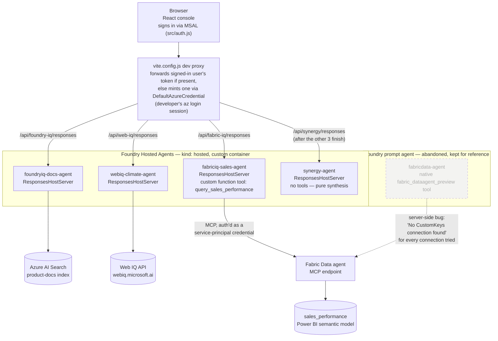

# Real Azure implementation — Foundry IQ, Fabric IQ & Web IQ

Stages 1–3 proved the *shape* of grounding — data mapped to the right IQ product, normalized into citable records, access-controlled and audited — entirely with mock data and a hand-written keyword matcher. Stage 4 made one of those four IQ products real: an actual deployed agent, grounded on real Azure infrastructure, answering real questions with real citations. Stage 5 made a second one real: Fabric IQ, scoped to the Sales Performance domain, grounded on an actual Fabric semantic model. Stage 6 made a third real: Web IQ, scoped to the Climate/Disaster Risk domain, grounded on Microsoft's real, live Web IQ web-search API. Stage 7 shows what those three real agents are worth *together*: one typed question fans out to all three live agents concurrently, and a fourth live agent (no tools — pure synthesis) combines their three answers into one attributed takeaway, rather than the demo ever hand-writing what a "combined" answer would say. Work IQ, the rest of Fabric IQ's domains (CRM, Telemetry, Support Cases, and the cross-domain composite), and Web IQ's Permits domain remain documented here architecturally but not built.

## Architecture

All three live agents are custom-hosted Foundry Hosted Agents (`kind: hosted`, `agent_framework_foundry_hosting.ResponsesHostServer`), called from the browser through `vite.config.js`'s dev-only proxy. The browser signs the user in via MSAL (`src/auth.js`) and attaches that user's own bearer token to the request when present; the proxy passes it through unchanged. If no one is signed in, the proxy falls back to minting a token from the developer's own `az login` session (`DefaultAzureCredential`), so `npm run dev` still works standalone with no sign-in required. Either way, that token only authorizes the *call into the Foundry agent endpoint itself* — it has nothing to do with how each agent's own tools authenticate outbound to their data source, which is a separate, per-agent concern (see each agent's section below).

**A note on the two auth layers, since they're easy to conflate**: the MSAL sign-in above governs *who's allowed to call the Foundry agent endpoint at all* — the same gate for all three agents, and unrelated to how any individual agent's tool reaches its own backing data. Fabric IQ went through three different answers to that second, tool-level question before landing on the current one (see "What's built: Fabric IQ sales agent" below): Foundry's native Fabric tool (broken server-side), a Foundry-portal "prompt agent" relying on true end-user OBO (worked, but meant the *browser's* dev-login session was the only identity ever exercised, since there was no real sign-in yet), and finally a custom function tool authenticating as a fixed service principal (works regardless of who's signed in as the browser user).

## Why Foundry IQ first, Fabric IQ second, Web IQ third

| Data domain | Mapped IQ product | Status |
|---|---|---|
| Sales performance | **Fabric IQ** | **Built and deployed** |
| CRM, Telemetry, Support cases | **Fabric IQ** | Documented only (mock matcher) |
| M365 (calendar, inbox, Teams) | **Work IQ** | Documented only |
| Climate/disaster risk | **Web IQ** | **Built and deployed** |
| Permits | **Web IQ** | Documented only (mock matcher) |
| Product Docs | **Foundry IQ** | **Built and deployed** |

Foundry IQ (via Azure AI Search) was the cheapest real thing to stand up: no external tenant/consent flow, no Fabric workspace or semantic model, no Bing Grounding resource returning uncontrolled live results — just an Azure AI Search resource, an index, and documents. It also reuses this repo's own `src/data/raw/productDocs.js` directly as seed content, so there was no new data to invent.

Fabric IQ was scoped to Sales Performance only rather than all four of its mapped domains — building a real, multi-table semantic model with relationships is meaningfully more Fabric modeling work than one table, and mirrors the "prove the pattern with one domain first" precedent Foundry IQ set. CRM, Telemetry, Support Cases, and the cross-domain composite record stay on the Stage 2 mock matcher.

Web IQ was scoped to Climate/Disaster Risk only, not Permits, matching the same "one domain first" precedent, and became available once real API access was confirmed (Microsoft's Web IQ product — a live web-grounding API for LLMs/agents — happens to share its exact name with this demo's own IQ-product taxonomy). Unlike Fabric IQ's Azure AD/RBAC saga, this integration's auth is a plain API key header — no tenant, no workspace, no role assignment to arrange.

## What's built: Foundry IQ docs agent

A second, independent Foundry Hosted Agent — separate from [`lead-agent-demo`](https://github.com/olivierb123/lead-agent-demo)'s already-deployed agent, with its own Foundry project, model deployment, and Azure AI Search resource. It follows the same deployment pattern `lead-agent-demo` proved out (`agent_framework.Agent` + `FoundryChatClient`, `agent_framework_foundry_hosting.ResponsesHostServer`, `azd ai agent init/provision/deploy`), so it exposes the same Responses-protocol `/responses` SSE endpoint the frontend already knows how to consume.

**Retrieval**: `agent/agent.py` wires an `AzureAISearchContextProvider` (from `agent-framework-azure-ai-search`) directly into the agent as a `context_providers` entry — Agent Framework already exposes Azure AI Search as a first-class hosted retrieval hook, so no custom function-tool fallback was needed. It queries the `product-docs` index in `semantic` mode (top 3 results) against a semantic configuration seeded by `scripts/seed_search_index.py`, and the agent's instructions require it to answer only from that retrieved context and always cite the source doc's title and `docId` inline.

**Indexing**: `scripts/seed_search_index.py` is a one-off script, run manually after provisioning, that creates the `product-docs` index (`id`, `docId`, `title`, `content`, `type`, `audience`, `lastUpdated` fields, plus a semantic configuration) and uploads the 4 docs from `productDocs.js` (hand-ported into the script — not worth a build step for 4 documents).

**Frontend**: `vite.config.js` runs a dev-only middleware proxy (`foundryIQProxyPlugin`) in front of `/api/foundry-iq/responses` — it mints an AAD bearer token via `DefaultAzureCredential` (backed by the developer's own `az login` session) and forwards the request to the deployed agent, so the browser never handles Azure credentials directly. `src/agentClient.js` streams the SSE response back to the UI. On the "Stage 2: Grounded Console" tab, a **"Live: Foundry IQ"** toggle routes Product-Docs-domain questions to this real agent instead of the mock matcher, rendering the real streamed answer and real citations (extracted from `DOC-\d+` mentions in the response text and resolved against `productDocs.js` metadata) in the same `RecordCard` shape — all other domains keep using the Stage 2 mock matcher, clearly labeled. This project has no public hosting yet, so a local dev-server proxy is sufficient — unlike `lead-agent-demo`'s publicly-hosted Static Web App, which needed an Azure Function proxy with its own service-principal auth.

## Gotchas hit during provisioning

- **Two distinct identities per hosted agent.** A deployed Foundry Hosted Agent has both the parent Cognitive Services account's identity and its own separate Instance Identity Principal ID. Role assignments (e.g. granting the agent read access to the Azure AI Search index) need to target the *agent's* instance identity, not the parent account — granting the wrong one silently doesn't work rather than erroring clearly.
- **Env var injection isn't automatic.** `azd ai agent init` doesn't auto-populate an `env:` block for a hosted agent's deployment — it has to be added explicitly to `azure.yaml` (see `agent/azure.yaml`'s `env:` block under the `foundryiq-docs-agent` service) or the container never receives `AZURE_SEARCH_ENDPOINT`, `AZURE_SEARCH_INDEX_NAME`, etc. at runtime, even though they're present in the local `.env`. This isn't quite enough on its own, either — `azure.yaml`'s `${VAR}` substitution reads from **azd's own environment store**, not the local `.env` file, so new env vars also need `azd env set KEY value` before a deploy will inject them.

## What's built: Fabric IQ sales agent

A Foundry Hosted Agent (`fabriciq-sales-agent`, `kind: hosted`, `agent_framework_foundry_hosting.ResponsesHostServer`) — same pattern as Foundry IQ and Web IQ — grounded on a published **Fabric Data agent** item, but reached through a custom function tool (`agent/fabric_tools.py`'s `query_sales_performance`) that calls the Fabric Data agent's own MCP endpoint directly, rather than through Foundry's native `fabric_dataagent_preview` tool. This is the third architecture this integration has gone through; the first two are documented in the gotchas below because the reasoning behind why they failed is what justifies this one.

**Why direct MCP instead of Foundry's native Fabric tool**: the native tool's connection resolution is broken server-side — every Foundry connection pointed at the published Data agent (ARM-created or portal-created, `CustomKeys` or otherwise) returns `"No CustomKeys connection found"` at invocation time, regardless of how it's configured. This was fully ruled out as a client-side config problem (see the "prompt agent" and "hosted container, native tool" gotchas below). The Fabric Data agent's MCP endpoint (`https://api.fabric.microsoft.com/v1/mcp/workspaces/{workspace_id}/dataagents/{data_agent_id}/agent`, documented at [Fabric data agent scenario docs](https://learn.microsoft.com/en-us/fabric/data-science/data-agent-scenario)) turns out to accept **any** AAD credential scoped to `https://api.fabric.microsoft.com/.default` — not just end-user OBO tokens — so a plain service-principal credential works, sidestepping Foundry's broken connection layer entirely. `fabric_tools.py` authenticates with `ClientSecretCredential`, opens an MCP session via the `mcp` package's `streamablehttp_client`/`ClientSession`, and calls the Data agent's one exposed tool with the user's natural-language question.

**Auth**: a dedicated service-principal (`fabric-mcp-smoketest` app registration — the name is a holdover from when it was meant to be disposable; it was kept and promoted to the permanent credential rather than provisioning a second one), granted **Member** role on the Fabric workspace (`PATCH https://api.fabric.microsoft.com/v1/workspaces/{id}/roleAssignments/{assignmentId}` with `{"role":"Member"}`). This is a fixed identity, not the signed-in browser user — see the "two auth layers" note in the Architecture section above for why that's fine: the MSAL sign-in governs the call into the Foundry agent endpoint, not how this tool reaches Fabric.

**The Fabric Data agent item**: created in the Fabric portal (**+ New item → Data agent** — there's no documented public REST API to create one), pointed at the existing `sales_performance` Power BI semantic model, and published. It handles retrieval, NL2DAX query generation, and execution internally.

**The semantic model**: a Power BI **Import-mode** semantic model built directly from a CSV export of `src/data/raw/salesPerformance.js` (via `scripts/export_sales_performance_csv.py`), uploaded through the Fabric portal's "+ New item → Semantic model" flow — not a Fabric Lakehouse-backed Direct Lake model. See the Direct Lake gotcha below for why.

Citations: the Fabric Data agent's own answer text is returned as-is, with no structured citation object (unlike the old prompt-agent path, which got `url_citation` annotations for free) — so the agent's instructions require it to always end its answer with a fixed citation line, and the frontend's `doneCitations` for this record stays a matching fixed string (`src/App.jsx`'s `LIVE_IQ_RECORDS['fabric-iq-sales']`).

## Gotchas hit building Fabric IQ

- **A hosted container can never call the *native* Fabric tool (`fabric_dataagent_preview`), no matter how the connection is configured — but that's specific to that tool, not to hosted containers in general.** The Fabric tool only supports true end-user (On-Behalf-Of) authentication — Microsoft's docs state service principals aren't supported — but a hosted container always authenticates its outbound calls using its own managed identity via `DefaultAzureCredential()`. From AAD's perspective a container's managed identity is indistinguishable from a service principal, so every invocation failed identically regardless of which connection was configured. This ruled out the native tool for a hosted container specifically, and was the reason the architecture moved (temporarily) to a Foundry-portal "prompt agent" instead — see below.
- **The Foundry-portal "prompt agent" (`fabricdata-agent`) with the native Fabric tool worked, for a while — then broke server-side, unfixably.** A prompt agent (no custom code, configured entirely in the Foundry portal, calls authenticated as the real caller via OBO) sidesteps the hosted-container/managed-identity problem above, since OBO flows through the actual signed-in caller. This worked initially. It later started failing with `"No CustomKeys connection found"` on every connection tried, including ones that had previously worked and freshly portal-recreated ones — narrowed down to a server-side connection-resolution bug in Foundry itself, not anything fixable from this project (confirmed via direct ARM/API inspection of the connection resource, which looked correct). This is what motivated bypassing Foundry's Fabric tool entirely — see "What's built" above.
- **The Agent Framework SDK exposes no mechanism to forward an inbound caller's token to tool code, ruling out a manual OBO exchange as a fix.** Before committing to the service-principal approach, `azure/ai/agentserver/core/_request_context.py` (the hosted-container SDK's per-request context) was read in full: it exposes only an opaque `call_id` (forward-only, "never parse it"), a `user_id` explicitly documented as *not* trusted by first-party services, and a `session_id` — no raw Authorization header or bearer token anywhere. A targeted grep across `azure/ai/agentserver/` for any authorization/token-forwarding hook came back empty. So a hosted container's tool code architecturally cannot do its own OBO exchange using anything the SDK provides — the service-principal-via-MCP route isn't a workaround for laziness, it's the only remaining option once OBO is off the table for a hosted container.
- **Creating the Foundry connection via ARM PUT didn't reliably produce a working connection.** The documented recipe (`PUT .../connections/<name>?api-version=...` with a `CustomKeys` credential holding the Data agent's `workspace_id`/`artifact_id`) returned a success response, but invocations against it still failed to find the connection. (Moot now that the native tool is bypassed entirely, but kept here since it's part of why the connection layer was never trusted.)
- **The Power BI dataset-user-sharing API doesn't support service principals.** `POST https://api.powerbi.com/v1.0/myorg/groups/{groupId}/datasets/{datasetId}/users` with `principalType: "App"` returns `400 InvalidRequest: "API supported only for User or Group principal types"`. Item-level dataset sharing is a dead end for a service principal; workspace-level role assignment is the only path (see next gotcha).
- **Workspace `Viewer` role is not enough for a service principal to read through to the semantic model via the Data agent — it needs `Member`.** With the SP granted only `Viewer`, MCP auth succeeded but every query came back "I don't have permission to read it." Elevating the SP's workspace role assignment to `Member` (`PATCH .../roleAssignments/{assignmentId}`) resolved it immediately, with no other change.
- **A paused Fabric trial capacity surfaces as an MCP error, not a permissions error, and looks identical to an auth failure at first glance.** `mcp.shared.exceptions.McpError: Internal error CapacityNotActive.Capacity <id> is not active` — actually a sign that auth and permissions were already fine (the request reached the data-agent logic) and the underlying Fabric/Power BI capacity itself was paused. Resuming the capacity via the Fabric/Power BI admin portal resolved it.
- **Direct Lake semantic models were unreliable for app-only auth (both the Agent Identity and a classic service principal), and eventually the whole model.** Against the Lakehouse's auto-generated default semantic model (Direct Lake mode), delegated (interactive user) auth worked fine, but every app-only identity — Foundry's Agent Identity, and a dedicated classic Entra app registration tried as a fallback — got a flat 401 despite identical, fully-verified RBAC at every layer: workspace role, dataset permission, Lakehouse direct-access ACL, and OneLake Security role membership. The dataset later broke entirely, failing with `"Failed to open the MSOLAP connection"` even for the previously-working dev account, traced to the workspace's Fabric capacity going inactive/detached. Rather than keep fighting Direct Lake's platform quirks, the fix was to sidestep it: delete the Lakehouse-backed default semantic model and the Lakehouse itself, and build a plain **Import-mode** semantic model directly from a CSV upload. Import mode only needs classic workspace role + dataset permission — no Lakehouse-specific ACL layer.
- **Deleting a Fabric item doesn't auto-regenerate it.** Deleting a Lakehouse's default semantic model via the Fabric REST API, then reopening the Lakehouse in the portal, does not cause Fabric to recreate it — a new semantic model has to be created explicitly.

## What's built: Web IQ climate agent

A fourth Foundry Hosted Agent, `webiq-climate-agent`, sharing the same Foundry project and model deployment as the other two but with its own entry point, instructions, and tool (`agent/webiq_agent.py`, `agent/webiq_server.py`). It answers Climate/Disaster Risk questions grounded on Microsoft's real, live **Web IQ** product (`webiq.microsoft.ai`) — not the Stage 2 mock matcher.

**Retrieval**: like Fabric IQ, there's no native Agent Framework hosted tool for this service, so `agent/webiq_tools.py`'s `search_climate_risk(query, max_results=5)` is a custom function tool that calls Web IQ's `POST /search/web` endpoint (`https://api.microsoft.ai/v3/search/web`) directly with `requests`, appending a fixed `site:noaa.gov OR site:fema.gov OR site:weather.gov` scope onto the model's query so results stay anchored to authoritative hazard sources rather than an arbitrary web page. It returns each result's `title`, `url`, `domain` (falling back to the URL's host if the API omits it), `content`, `lastUpdatedAt` (falling back to `crawledAt`), and `sourceQuality`. The agent's instructions mandate a fixed inline citation format — `Source: <domain> — "<title>" (updated <lastUpdatedAt>)` — parsed out of the streamed response text by `extractWebCitations` in `src/App.jsx`, giving genuine per-query citations from live search results rather than a single fixed string.

**Auth**: a plain API key in the `x-apikey` request header (`WEBIQ_API_KEY`) — Web IQ also supports an Entra bearer-token option, but the API key is simpler and needs no app registration, RBAC grant, or workspace access of any kind. Meaningfully less setup than Fabric IQ's Azure AD saga.

## Gotchas hit building Web IQ

- **The product's own documentation pages were unreliable; the OpenAPI spec was the only authoritative source.** Web IQ's human-readable API-reference and Authentication doc pages returned marketing/FAQ content instead of technical detail when fetched (the product is in limited enterprise access). The real, structured contract — endpoints, auth schemes, request/response field names — only came from the OpenAPI JSON spec at `https://webiq.microsoft.ai/documentation/openapi.json`, linked from `https://webiq.microsoft.ai/llms.txt`.
- **Some documented response fields (`domain`, `lastUpdatedAt`) aren't always present.** A raw test call against the live API returned results with `title`/`url`/`content`/`crawledAt` but no `domain` or `lastUpdatedAt` on every result, despite both being in the OpenAPI schema. `webiq_tools.py` derives `domain` from the URL's host as a fallback and falls back to `crawledAt` for the date, so citations stay populated either way.

## What's built: cross-IQ synergy — fan-out + live synthesis

A fourth Foundry Hosted Agent, `synergy-agent` (`agent/synergy_agent.py`, `agent/synergy_server.py`), sharing the same Foundry project and model deployment as the other three. Unlike the other three, it has **no tools at all** — `agent_framework.Agent` accepts `tools=None` as a fully valid construction, and this agent's only job is to read three already-grounded, already-cited answers handed to it inline in the prompt and synthesize them into one short, attributed takeaway. It never calls out to any data source itself; its only "grounding" is the text of the other three agents' real answers.

**The demo question**: "Where should we focus new lead generation — factoring in territory quota performance, regional storm risk, and our competitive edge against Procore?" — deliberately built so no single IQ product can answer it alone: quota performance lives in Fabric IQ's sales semantic model, storm risk in Web IQ's live hazard search, and competitive positioning in Foundry IQ's indexed docs.

**Execution flow** (`src/App.jsx`): the composite mock record `composite-leadgen-focus` (`src/data/mockRecords.js`) carries a `fanOut` config of three sub-questions, one per real agent, reusing each agent's already-proven canonical question. When Live mode matches this record, all three agent calls run **concurrently** (`Promise.all`, not sequential awaits) — each streams into its own slice of a `bySource` state map. Once all three finish (success or error), a fourth call fires to `synergy-agent` with an `input` string built from each source's final text, and its streamed response renders as a separate "Synthesized takeaway" panel. The existing single-domain live queries (Fabric IQ, Foundry IQ, Web IQ alone) are unaffected — fan-out is additive, selected only when the matched record declares a `fanOut` config.

**Why a live synthesis call instead of hardcoded prose**: consistent with this project's practice of only ever showing things that are actually live (see the MSAL and per-agent sections above) — a canned "combined takeaway" string would misrepresent what the demo is proving, which is that the value of combining IQ products holds up even when the combining step itself is a real model call with no special-cased answer.

## What's built: real user sign-in (MSAL)

The **"Live"** toggle no longer runs every request as whichever developer happens to have an `az login` session open — the browser itself authenticates a real Entra ID user via MSAL (`src/auth.js`, `@azure/msal-browser`), and that user's own access token is what the header sign-in state reflects and what the proxy forwards. A new SPA app registration backs this (public client, no secret — PKCE); clicking **"Sign in"** triggers `signIn()`, showing the signed-in account's name and a **"Sign out"** button once complete. Turning on **Live** mode calls `getAccessToken()` first and only proceeds if sign-in succeeds. `vite.config.js`'s proxy forwards an incoming `Authorization` header as-is when present (see `iqAgentProxyPlugin` in the Architecture section above); with no one signed in, it falls back to minting a token from `DefaultAzureCredential`, so `npm run dev` still works standalone.

**Gotcha**: MSAL popup sign-in doesn't work against `login.microsoftonline.com` from this setup — the login page responds with a `Cross-Origin-Opener-Policy: same-origin` header, which permanently severs a popup window from its opener the moment the popup navigates through the login flow, regardless of what the redirect-URI landing page does afterward. The opener is left with no way to ever detect completion or close the popup. `src/auth.js` uses full-page redirect (`loginRedirect`/`acquireTokenRedirect`) instead, which sidesteps the COOP restriction entirely since there's no popup/opener relationship to sever.

**What this does and doesn't change for Fabric IQ specifically**: real sign-in was originally motivated by wanting Fabric IQ's OBO auth to reflect the actual browser user rather than the developer's dev-login session. That motivation is now moot — Fabric IQ's tool authenticates as a fixed service principal regardless of who's signed in (see "What's built: Fabric IQ sales agent" above) — but the sign-in flow was kept as a shared gate for all three agents anyway, since it still governs the (separate) question of who's allowed to call the Foundry agent endpoint at all, and Foundry IQ/Web IQ's own tool auth (managed identity, API key) was never affected by any of this either way.

## What's documented but not built

### Fabric IQ — CRM, telemetry, support cases
The same Fabric Data Agent pattern proven out for Sales Performance, extended to the other three tabular domains (Dynamics 365 Sales, an internal telemetry warehouse, a support system of record) as one shared semantic model with proper relationships across tables — meaningfully more Fabric modeling work than a single flat table, and out of scope for this pass.

### Work IQ — M365 (calendar, inbox, Teams)
A connector grounded directly in Microsoft Graph data the org already has. Making this real requires an actual M365 tenant, Entra app registration with delegated Graph consent (`Calendars.Read`, `Mail.Read`, `Chat.Read`, etc.), and a real user's mailbox/calendar/Teams history to query against — meaningfully more setup than the other three IQ products, and the reason it wasn't picked for the first real integration.

### Web IQ — permits
The same Web IQ web-search pattern proven out for Climate/Disaster Risk, scoped instead toward municipal permit registries and filings — out of scope for this pass, matching the "prove the pattern with one domain first" precedent.

## Verification

The deployed Foundry IQ docs agent was smoke-tested directly (curl, through the deployed `/responses` endpoint) with the canonical "How do we position FieldForge against Procore?" question and returned a real answer citing `DOC-2` (the competitive battlecard), and the same question was verified end-to-end through the browser via the "Live: Foundry IQ" toggle.

The Fabric IQ agent's `query_sales_performance` tool was first smoke-tested as a standalone script, directly against the Fabric Data agent's MCP endpoint using the service-principal credential, confirming raw MCP auth/permissions end-to-end ("Total sales last quarter were 1,184,000"). The rewritten `fabric_agent.py`/`fabric_server.py` was then verified locally through the actual `ResponsesHostServer` HTTP endpoint (`POST http://localhost:8088/responses`), returning that same figure through the real tool-calling path. The deployed `fabriciq-sales-agent` was redeployed with the new env vars (`azd deploy fabriciq-sales-agent`) and smoke-tested with a direct `curl` against its Responses endpoint using "Which territories are behind quota this quarter, and by how much?", returning a real, correctly-computed answer (West and South territories, with accurate variance percentages) grounded in the live Fabric Data agent.

Real sign-in (MSAL) was verified by signing in through the browser's "Sign in" button, confirming the "Live" toggle only activates after a successful redirect sign-in, and confirming (via browser devtools) that the request reaching `vite.config.js`'s proxy carries the signed-in user's own bearer token rather than one minted from the developer's `az login` session.

The Web IQ climate agent's underlying tool was smoke-tested with a raw `curl` call against the live `/search/web` endpoint before any agent code was written, confirming the key and contract both work (real NOAA hurricane-advisory results for a Miami-Dade storm-risk query). The deployed agent itself was then smoke-tested via `azd ai agent invoke webiq-climate-agent` with "What's the storm risk outlook for our Miami-Dade project?" and verified end-to-end through the browser via the "Live: Web IQ" toggle on the Climate/Disaster Risk record.

The `synergy-agent`'s no-tool synthesis was first verified locally: `agent/synergy_agent.py`/`synergy_server.py` run through the real `ResponsesHostServer` HTTP endpoint (`POST http://localhost:8088/responses`) with a canned 3-source input (quota, storm risk, competitive positioning) produced a genuine, correctly-attributed takeaway grounded only in that inline text — confirming a tool-less `Agent` construction (`tools=None`) is valid before any cloud deployment was made.
