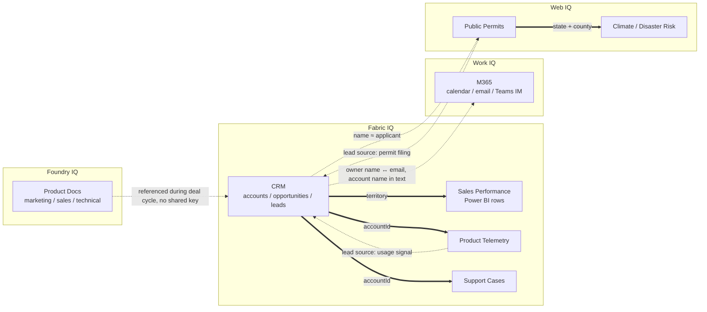

# Data relationships & classification

Before normalizing anything, it's worth seeing how the 8 source-shaped mock domains (`src/data/raw/*.js`) actually relate to each other — and being honest about which relationships are exact key joins versus fuzzy/inferred ones. That distinction is itself a grounding problem: an agent that treats a name-match the same as a foreign-key match will eventually get it wrong.

## Classification

| Domain | Format | IQ product | Participates via |
|---|---|---|---|
| CRM (`crm.js`) | Structured | Fabric IQ | `accountId` (exact), `territory` (exact), owner/seller name (fuzzy) |
| Sales performance (`salesPerformance.js`) | Structured | Fabric IQ | `territory` (exact) |
| Product docs (`productDocs.js`) | Unstructured | Foundry IQ | no shared key in the mock data — referenced by topic/context only |
| M365 (`m365.js`) | Semi-structured (structured metadata + free-text body) | Work IQ | organizer/sender email ↔ owner name (fuzzy), account name mentioned in subject/snippet (fuzzy) |
| Permits (`permits.js`) | Structured | Web IQ | `applicant` name ↔ CRM account name (fuzzy), `jurisdiction.state`+`county` (exact) |
| Climate/disaster risk (`climateRisk.js`) | Structured | Web IQ | `state`+`county` (exact) |
| Telemetry (`telemetry.js`) | Structured | Fabric IQ | `accountId` (exact) |
| Support cases (`supportCases.js`) | Semi-structured (structured fields + free-text subject) | Fabric IQ | `accountId` (exact) |

## Relationship graph

**Solid edges** are exact key joins (`accountId`, `territory`, `state`+`county`) — safe to automate. **Dashed edges** are fuzzy or inferred — a name-match, an email-to-person match, or a plain-text mention. Those are exactly where normalization (Stage 2) has to do real work, and where governance (Stage 3) needs to require a confidence/citation trail rather than silently trusting the match.
